## Chapter 1
#### Zwei grundliegende Arten von Softwareprodukten:
* __Generische  Produkte__ sind eigenständige Systeme, die von einem Softwareent-wicklungsunternehmen hergestellt wurden
  und auf dem freien Markt an jedenKunden verkauft werden, der sie sich leisten kann.
  Beispiele für diese Art von Produkten sind Apps für mobile Geräte, Software für PCs, wie Datenbanken,
  Textverarbeitungsprogramme, Grafikpakete oder Projektverwaltungswerkzeuge. Zu dieser Softwareart gehören auch „vertikale“ Anwendungen,
  die für einen spe-ziellen Markt entworfen wurden, wie Bibliotheksinformationssysteme,
  Abrech-nungssysteme oder Systeme zur Verwaltung von zahnärztlichen Aufzeichnungen.
* __Angepasste (oder bestellte) Softwaresysteme__ sind Systeme, die im Auftrag einesbestimmten Kunden für diesen hergestellt werden.
  Ein Softwareanbieter entwi-ckelt die Software speziell für diesen Kunden. Beispiele für solche Auftragssoft-ware sind Steuerungssysteme für elektronische Geräte,
  Systeme zur Unterstüt-zung eines bestimmten Geschäftsprozesses und Flugsicherungssysteme.
#### die  wesentlichen  Charakteristika  eines  professionellen  Soft-waresystems:
* __Akzeptanz (acceptability)__
* __Verlässlichkeit (dependability) und Informationssicherheit (security)__
* __Effizienz (efficiency)__
* __Wartbarkeit (maintainability)__
#### Vier allgemeine Probleme betreffen viele unterschiedliche Soft-waretypen
* __Heterogenität__: verschiedene Platformen (Mobile, Web, Unix, Windows z.B.)
* __Geschäftliche  und  soziale  Veränderungen__: Unternehmen müs-sen in der Lage sein, ihre vorhandene Software zu ändern und schnell neue Software zu entwickeln.
Viele traditionelle Software-Engineering-Techniken sindsehr zeitaufwendig und die Auslieferung neuer Systeme dauert länger als geplant.
* __Sicherheit und Vertrauen:=__: Da Software mit allen Aspekten unseres Lebens verflochten ist, müssen wir dieser Software vertrauen können.
* __Skalierung__: Software muss über ein breites Spektrum von Skalierungen entwickelt werden, von sehr kleinen eingebetteten System in portablen
  oder z. B. in-nerhalb von Kleidung tragbaren Geräten bis hin zu Cloud-basierten Systemen inInternetgröße, die einer globalen Gemeinschaft dienen.
#### Viele unterschiedliche Anwendungsarten
* __Eigenständige (stand-alone) Anwendungen__:  Dies  sind  Anwendungssysteme,  dieauf  einem  PC  oder  Apps,  die  auf  einem  mobilen  Gerät  laufen. 
* __Interaktive transaktionsbasierte Anwendungen__: Diese Anwendungen werden aufeinem entfernten Computer ausgeführt. Die Benutzer können entweder von ihreneigenen PCs, Telefonen oder Tablets aus darauf zugreifen.
* __Eingebettete Steuerungssysteme__
* __Stapelverarbeitende (batch processing) Systeme__: Dies sind Geschäftssysteme, diezur Verarbeitung großen Datenmengen entworfen wurden. Sie bearbeiten viele individuelle Eingaben, um die dazugehörigen Ausgaben zu erzeugen.
  Beispiele fürStapelverarbeitungssysteme  sind  Systeme  zur  Abrechnung  von  regelmäßigenZahlungen wie Telefonabrechnungssysteme und Lohnauszahlungssysteme.
* __Unterhaltungssysteme__: Dies  sind  Systeme,  für  die  private  Nutzung,  die  zur  Unterhaltung ihrer Nutzer dienen.
* __Systeme für die Modellierung und Simulation__: Dies sind Systeme, die von Wis-senschaftlern und Ingenieuren entwickelt wurden, um physikalische Vorgängeoder Situationen zu modellieren,
  in denen viele separate, interagierende Objekteauftreten.
* __Systeme  zur  Datenerfassung  und  -analyse__: Datenerfassungssysteme sind Systeme, die Daten aus ihrer Umgebung sammeln und diese Daten an andere Systeme zur Verarbeitung senden.
* __Systeme  von  Systemen__: Diese sind Systeme, die in Unternehmen und anderengroßen Organisationen eingesetzt werden und die aus vielen anderen Softwaresystemen zusammengesetzt sind.
#### Softwareentwicklung und das Intenet
Heute ist Software hochgradig verteilt, manchmal über dieganze Welt. Geschäftsanwendungen werden nicht von Grund auf neu programmiert,
sondern verwenden ausgiebig bestehende Komponenten und Programme. Dieser Wandel in  der  Softwareorganisation hatte einen gewaltigen Einfluss auf dasSoftware-Engineering von webbasierten Systemen. Zum Beispiel:
* die Wiederverwendung  von  Software
* Webbasierte Systeme werden immer inkrementell entwickelt und ausgeliefert werden.
* Software kann mithilfe von serviceorientiertem Software-Engineering implementiert werden, wobei die Softwarekomponenten eigenständige Webdienste sind.(HTTP, RESTful API)
* Es sind Technologien zur Schnittstellenentwicklung wie AJAX (Holdener, 2008)und HTML5 (Freeman, 2011) entstanden, mit denen umfangreiche Benutzeroberflächen innerhalb eines Webbrowsers erzeugt werden können.
#### Ethischer Kodex
* Vertraulichkeit
* Kompetenz
* Schutz des geistigen Eigentums
* Computermissbrauch
## Chapter2 : Softwareprozesse
### Drei allgemeine Vorgehensmodelle
* Wasserfallmodell: Dieses Modell stellt die grundlegenden Prozessabläufe wieSpezifikation, Entwicklung, Validierung und Evolution als eigenständige Phasendes  Prozesses  dar,  wie  zum  Beispiel  Anforderungsspezifikation,  Softwareent-wurf, Implementierung und Tests.
* Inkrementelle Entwicklung: Dieser Ansatz verknüpft die Aktivitäten der Spezifi-kation, der Entwicklung und der Validierung. Das System wird als eine Folge von Versionen  (Inkremente)  entwickelt, wobei jede Version neue Funktionalität zuder vorherigen hinzufügt.
* Integration und Konfiguration: Dieses Modell basiert auf der Verfügbarkeit von wiederverwendbaren Komponenten oder Systemen. Der Systementwicklungs-prozess beschäftigt sich mehr damit, diese Komponenten für den Einsatz in einerUmgebung zu konfigurieren und in ein System zu integrieren.
#### Wasserfallmodell
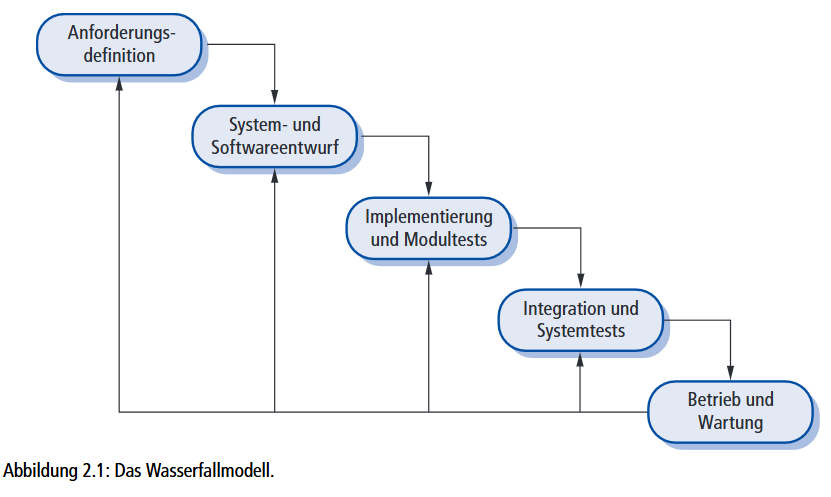
Wasserfallmodell ist geeignet für:
* Eingebettete Systeme
* Kritische Systeme
* Große Softwaresystem
#### Inkrementelle Entwicklung
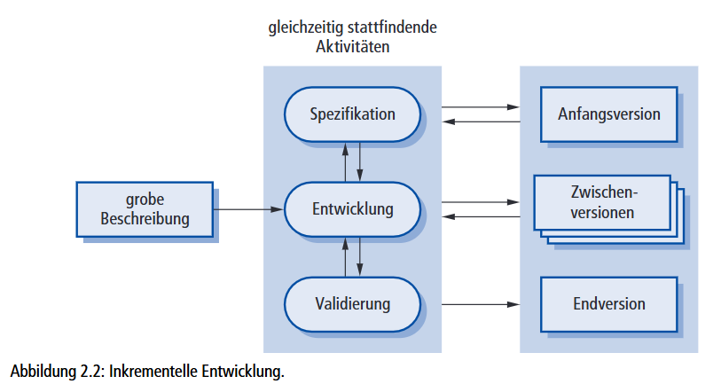
#### Integration und Konfiguration
Drei Arten von Software werden häufig wiederverwendet.
* Eigenständige Anwendungen, die für die Benutzung in einer bestimmten Umge-bung konfiguriert wurden. Dies sind Allzwecksysteme mit vielen Funktionen, aber sie müssen für den Einsatz in einer speziellen Anwendung angepasst werden.
* Sammlungen von Objekten, die als eine Komponente oder als ein Paket entwickelt werden, um mit Komponenten-Framworks wie Java Spring integriert zu werden (Wheeler und White, 2013).
* Webdienste, die im Hinblick auf Servicestandards entwickelt werden und die für entfernte Aufrufe über das Internet verfügbar sind.
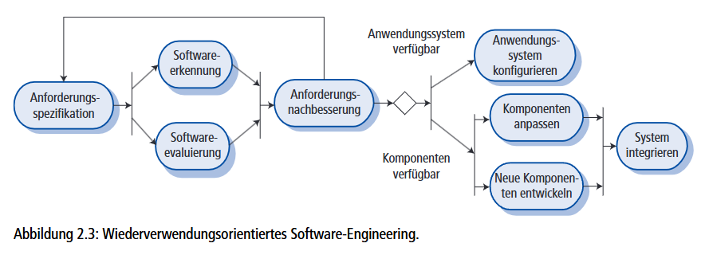
### Prozessaktivitäten
Reale Softwareprozesse sind überlappende Abfolgen von technischen, auf Zusammenarbeit basierenden und betriebswirtschaftlichen Aktivitäten mit dem Gesamtzielder Spezifikation, des Entwurfs, der  Implementierung und des Testens eines Soft-waresystems. Heutzutage werden Prozesse in der Regel durch Werkzeuge unterstützt. Das heißt, dass Softwareentwickler eine Vielzahl verschiedener  Softwarewerkzeugeals Hilfe benutzen können, zum Beispiel Anforderungsmanagementsysteme, Editorenzur Entwurfsmodellierung, Programmeditoren, automatische Testwerkzeuge und Debugger. Solche  Werkzeuge unterstützen besonders das Bearbeiten verschiedenerDokumenttypen und die Verwaltung des immensen Umfangs von detaillierten Informationen, die in einem großen Softwareprojekt erzeugt werden.
Die vier grundlegenden Prozessaktivitäten:
* Spezification
* Entwicklung
* Validierung
* Evolution
#### Spezifikation
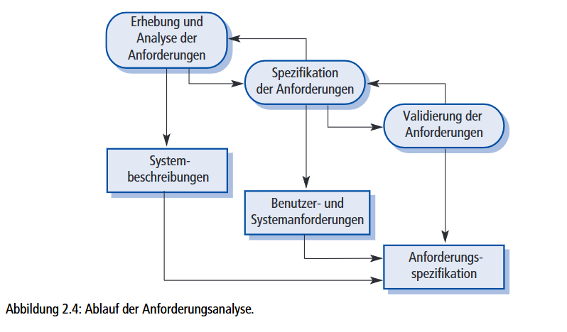
#### Entwicklung
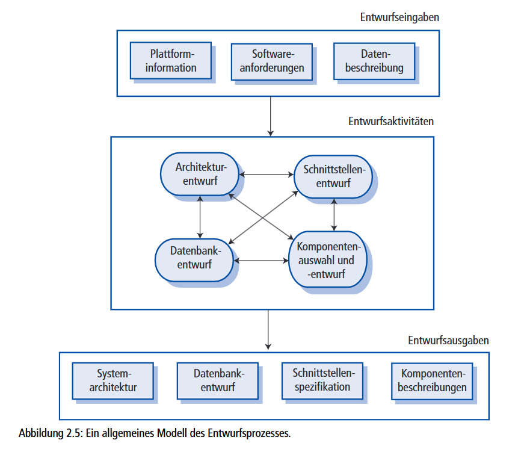
#### Validierung
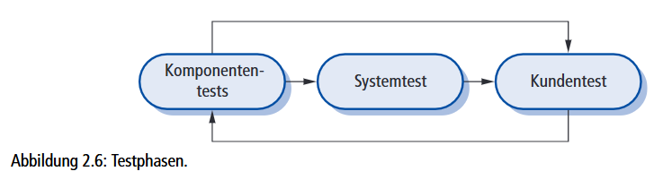
#### Evolution
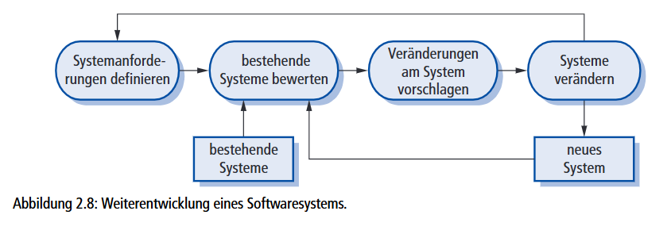
### Prozessverbesserungen
Die Grade im Prozessreifemodell sind:
* __Initial__: Die mit dem Prozessgebiet verknüpften Ziele wurden erreicht. Für alle Prozesse wird der Umfang der zu leistenden Arbeit explizit angegeben und denTeammitgliedern mitgeteilt.
* __Geführt__: Auf dieser Stufe werden die Ziele des Prozessgebiets erreicht und es be-stehen organisationsweite Richtlinien, die festlegen, wann die einzelnen Prozesseeinzusetzen sind. Es muss dokumentierte Projektpläne geben, die die Projektzielefestlegen. Für die gesamte Organisation müssen Ressourcenmanagement- und Pro-zessüberwachungsverfahren gelten.
* __Definiert__: Diese Stufe konzentriert sich auf Standardisierung und Umsetzung vonProzessen innerhalb des Unternehmens. Für jedes Projekt gibt es einen verwalte-ten Prozess, der aus einem  definierten Bestand organisationsweiter Prozesse an die Projektanforderungen angepasst wurde. Prozess-Assets und -messungen müssen gesammelt und für die spätere Prozessverbesserung genutzt werden.
* __Quantitativ verwaltet__: Auf dieser Stufe ist das Unternehmen zur Nutzung statisti-scher und anderer quantitativer Methoden zur Steuerung von Teilprozessen ver-pflichtet. Die gesammelten Prozess- und Produktmessungen müssen also bei derProzessverwaltung verwendet werden.
* __Prozessoptimierung__: Auf der höchsten Stufe muss das Unternehmen die Prozess-und Produktmessungen zur Steuerung der Prozessverbesserung einsetzen. Trendsmüssen analysiert und die Prozesse an veränderte geschäftliche Erfordernisse an-gepasst werden.

## Projektplannung
* Gantt-Chart
 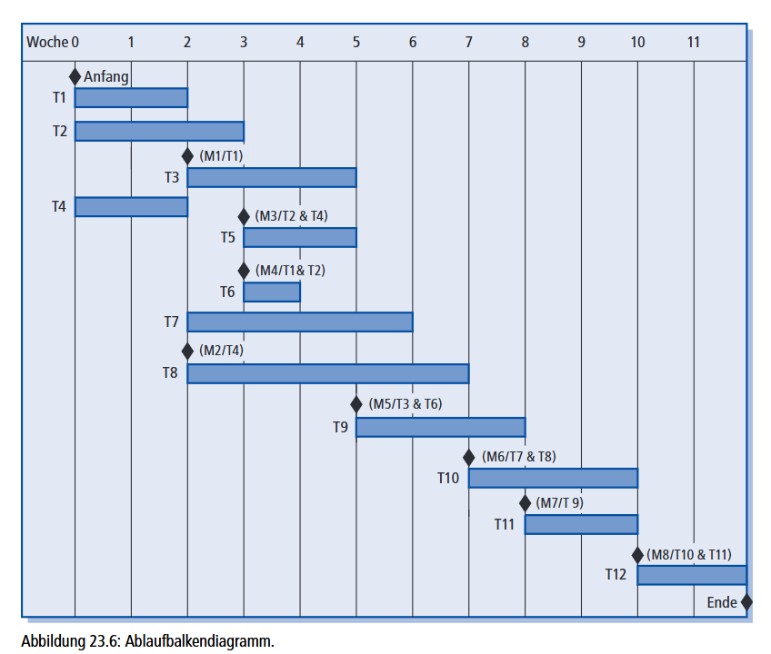
* Pert-Chart
 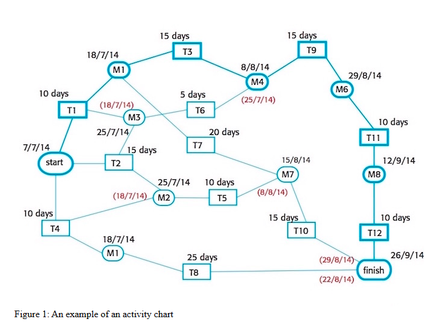
  
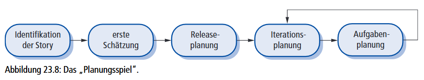
#### Algorithmische Kostenmodellierung
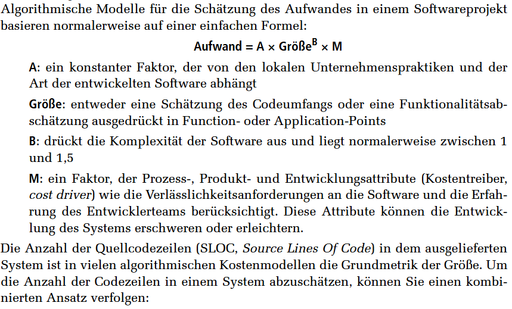

## Agile projectplannung
 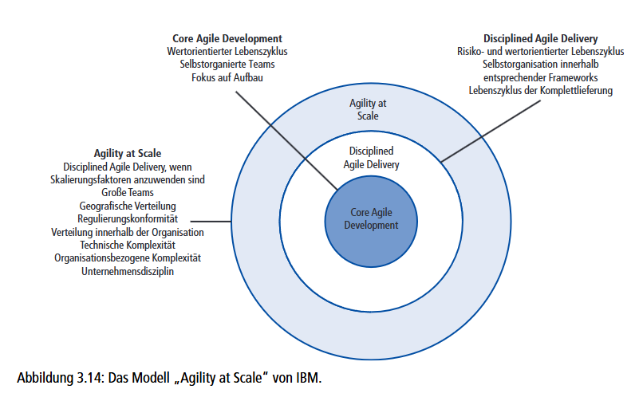
#### Scrum Artefakten
* Product Backlog
* Sprint Backlog
* Potentially Shippable Product Increment
#### Probleme bei Agile
* Die Formlosigkeit der agilen Entwicklung ist nicht mit dem juristischen Vorgehenbei der Vertragsgestaltung kompatibel, wie es häufig in großen Unternehmen durch-geführt wird
* Agile Methoden sind am besten für neue Softwareentwicklung geeignet, nicht so sehr für Softwarewartung. Doch der Hauptanteil der Softwarekosten in großenUnternehmen entsteht durch die Wartung ihrer vorhandenen Softwaresysteme.
* Agile Methoden sind auf kleine, am gleichen Ort untergebrachte Teams ausgelegt, doch ein Großteil der Softwareentwicklung wird heute von weltweit verteilten Teams durchgeführt.
#### Agile Principle
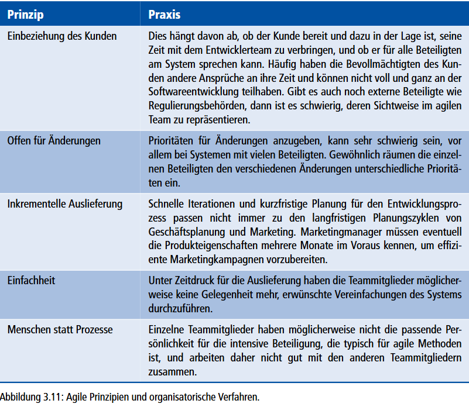
